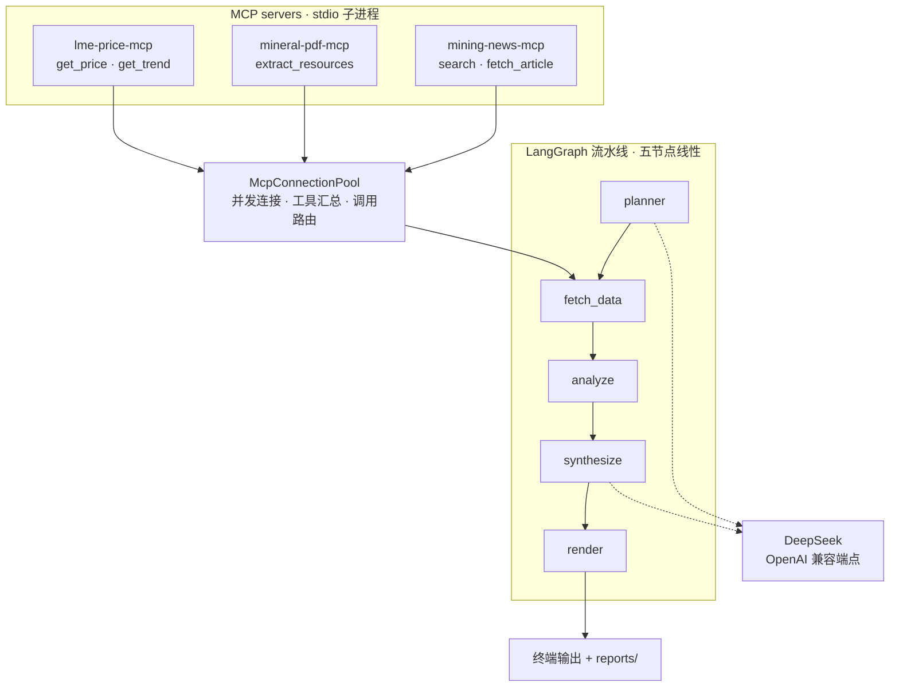

# mining-daily-agent

给一个主题（比如「Pilbara 锂矿」），自动抓新闻、抽资源量报告、取行情，再让 LLM 合成一份
带引用编号的 Markdown 每日简报。

[](https://github.com/xydd0/mining-daily-agent/actions/workflows/ci.yml)
[](https://www.python.org/)
[](pyproject.toml)

> ⚠️ **先读数据源策略**：LME 金属现货没有免费行情，价格取的是**代理 ETF 的份额价**
> （USD/share，不是 USD/t）；新闻与 PDF 源失败会**自动降级为示例数据并在简报中标注**。
> 详见 [RUN.md 的「数据源策略」](RUN.md#数据源策略读之前请务必了解)。

## 快速开始

```bash
git clone https://github.com/xydd0/mining-daily-agent.git
cd mining-daily-agent
cp .env.example .env      # 填入 DeepSeek API key
uv sync
uv run mining-daily-agent "给我生成一份关于 Pilbara 锂矿的今日简报"
```

完整步骤（含 Docker 路径）见 **[RUN.md](RUN.md)**。

## 架构



三个 server 都是**同一进程内的 stdio 子进程**，由连接池拉起——它们不是独立服务，
这也是镜像必须自包含的原因。分层细节与降级链路见
[docs/architecture.md](docs/architecture.md)。

## 工具清单

五个工具，分属三个 MCP server。工具描述统一用英文撰写——LLM 靠它选择工具。

| 工具 | 所属 server | 用途 |
|---|---|---|
| `search` | `mining-news-mcp` | 按关键词检索最近 N 天的矿业新闻（3 个 RSS 源依次尝试） |
| `fetch_article` | `mining-news-mcp` | 抓取单篇新闻正文（上限 8000 字符） |
| `extract_resources` | `mineral-pdf-mcp` | 从技术报告 PDF 抽取资源量表（含表头单位推断） |
| `get_price` | `lme-price-mcp` | 取某品种在指定交易日（或最新交易日）的价格 |
| `get_trend` | `lme-price-mcp` | 取某品种最近 N 个交易日的走势与均线 |

## 接到 Claude Desktop / Cursor

仓库根目录的 [`mcp-config.json`](mcp-config.json) 已按 Claude Desktop 格式写好三个 server。

1. 把里面**三处 `<REPO_PATH>`** 都替换成本仓库的绝对路径；
2. 内容整体复制进对应的配置文件：
   - **Claude Desktop**：`claude_desktop_config.json`
   - **Cursor**：`mcp.json`
3. 重启客户端，应当能看到 **5 个工具**。

> 为何需要 `--directory`：MCP 客户端拉起 server 时的工作目录不一定是本仓库，
> 而 `uv run` 依赖工作目录来定位项目——少了它，实测会直接
> `ModuleNotFoundError: No module named 'mining_daily_agent'`。

## Limitations

这是个**能降级、且降级一定留痕**的项目——但降级链路只保证失败被诚实记录，不保证
拿得到数据。四条边界写在 [docs/architecture.md 的 Known Gaps](docs/architecture.md#known-gaps--已知取舍)：

- **解析器是启发式的**：覆盖 JORC / NI 43-101 的常见表格形态，不保证任意年报都解得出。
  解析失败或结果可疑时，要么留空并给出原文、要么按 ±5% 容差改用报告自报合计；
  **绝不用合成数据冒充真实披露值**（合成数据一律带 `degraded` 标记并在简报里标注）。
  报告含多个项目时只取报告自报口径最大的那张表，未计入的在风险提示里列明。
- **新闻先过滤再进简报**：只保留讲主题主体的条目，剔除条数写在风险提示里；抓不到
  正文时导语退回该条自己的标题与摘要。**输出格式是写死的模板**，不靠 LLM 自由发挥。
- **Google News 的文章正文取不到**：RSS 里的链接是 Google 中转页，请求返回 200，
  但正文抽出来是 0 字符。
- **价格不是 LME 金属价**：LME 现货没有免费行情，取的是代理 ETF / 矿业公司的份额价
  （USD/share，不是 USD/t）。
- **LLM 是「有则更好」的依赖**：planner 输出不可解析时回退默认计划，没有 LLM 也能出简报。

## 开发方式

本项目全程由 **Claude Code CLI** 开发，底层模型经 **DeepSeek 的 Anthropic 兼容网关**接入。
由 Claude Code 编写的提交都带这条 trailer：

```
Co-Authored-By: Claude Code <noreply@anthropic.com>
```

（仓库里另有 6 个 GitHub 生成的合并提交与 1 条最初的项目基线提交，它们不带 trailer。）

分工是：AI 写代码、人做裁决与验收。每一步的范围、取舍、是否放行都由仓库所有者决定；
那些「看起来过了、其实没查」的坑（格式门禁、mypy 检查范围、假 CI 配置）也是在这种
分工下被逐步发现并修掉的，来龙去脉记在 [docs/architecture.md](docs/architecture.md)。

## 开发环境

```bash
bash scripts/gate.sh   # 四项门禁：ruff check / ruff format --check / mypy / pytest
```

门禁命令的唯一来源是 `scripts/gate.sh`，本地、pre-commit 与 CI 都调它。
